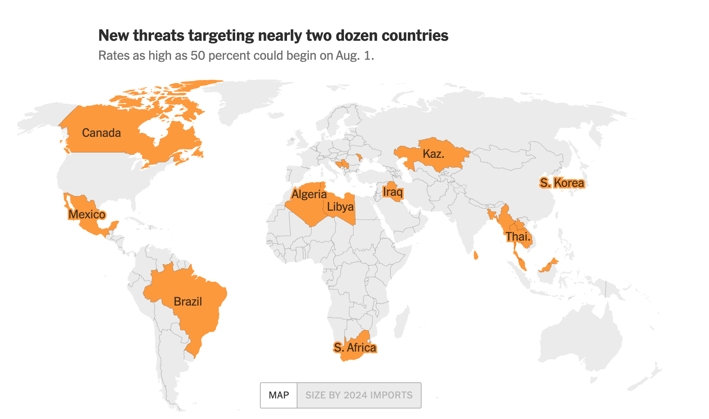
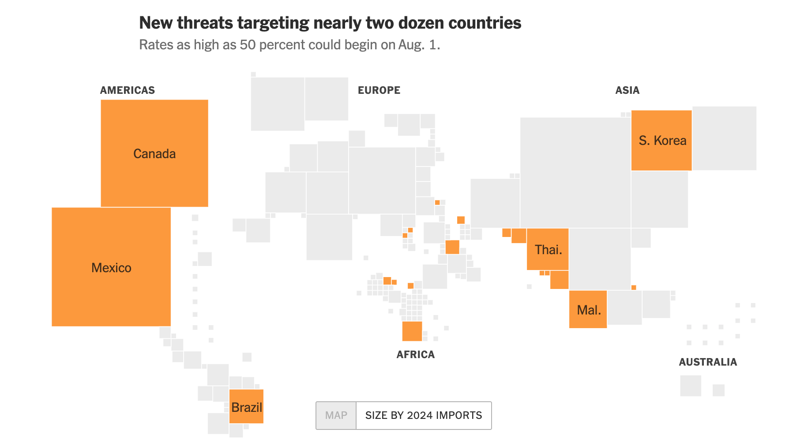
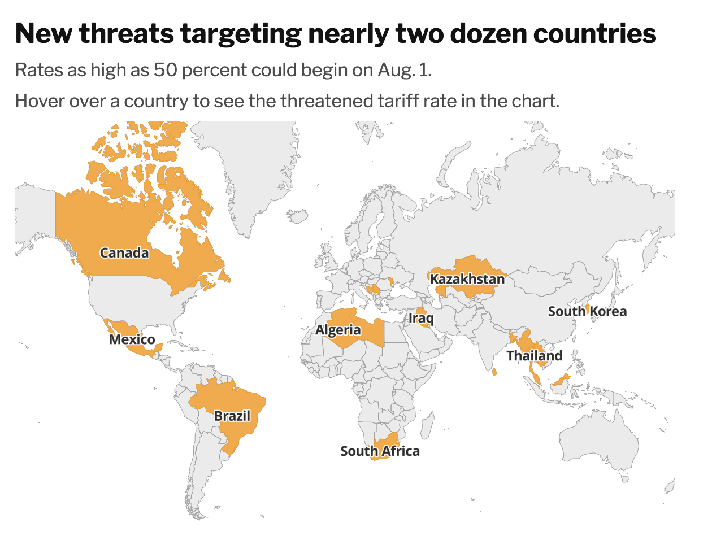
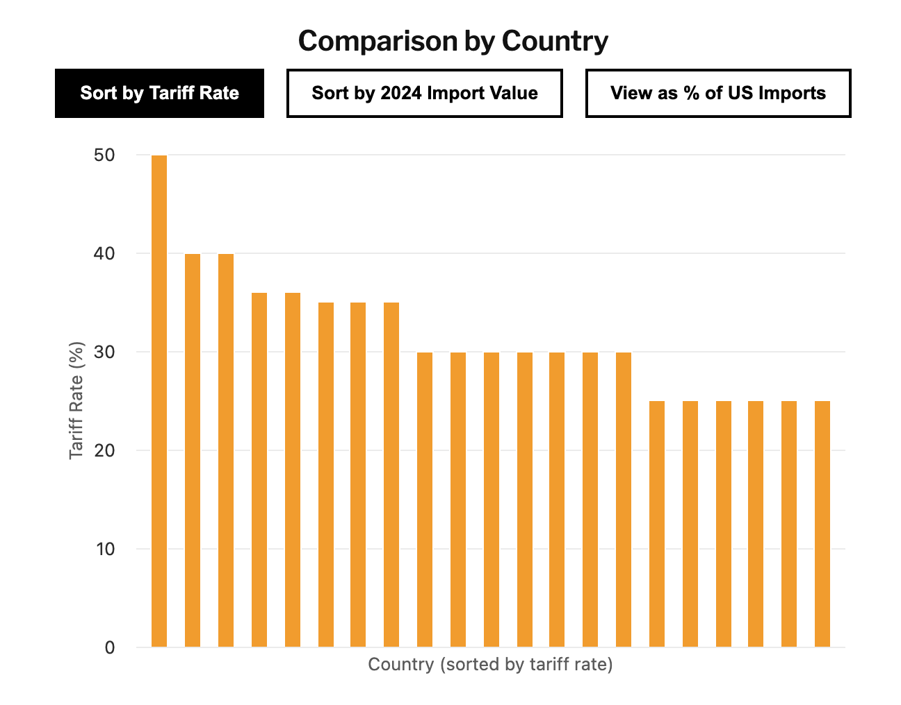
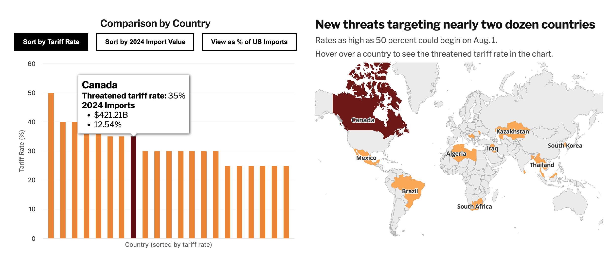

## Intro
For the live version of this repo, [click here](https://mariel-delagarza.github.io/tariffs-map/).

The map for this project was taken from the NYT's ["See Trump's New Tariffs on Every Country"](https://www.nytimes.com/interactive/2025/07/28/business/economy/trump-tariff-tracker.html?campaign_id=29&instance_id=159383&nl=the-upshot&regi_id=160286027&segment_id=202764&user_id=668a8d3a57aaa84bc48a03d3e56fd09e).

The NYT piece includes a static map, but doesn't allow interaction or seeing exactly what the tariff values are. 

You can click a button to "Size by 2024 Imports", but hovering over the countries or clicking around doesn't give any information about what the import values were. 

I used the data available at the bottom of the piece along with information from the Census Bureau, ["U.S. International Trade in Goods and Services December and Annual 2024"](https://www.bea.gov/sites/default/files/2025-02/trad1224.pdf) to create the column charts.

The colors and map style are taken from the NYT piece and the fonts are close approximations from Google Fonts.

## The Map

The map was created using [MapLibre](https://maplibre.org/) and geojson downloaded from [GeoJSON Maps](https://geojson-maps.kyd.au/). The Carto base style "Positron" was initially used before I more closely copied the NYT style. Rather than get rid of it, I kept it but visually hid it so I could get rely on its vector tiles for highlighting countries and hovering on the countries. 

## The charts

The charts were created using [Highcharts](https://www.highcharts.com/products/highcharts/). The charts were created because the original NYT piece doesn't give the values of the tariffs until you get to the table at the bottom. So when their map said "rates as high as 50 percent" it wasn't clear if it was only one country or several countries.

Creating the chart let me see at the same time as the map what exactly the tariff rates were. 

### Interacting with the Map
This project was partially an exercise in wiring interactivity between the charts and the map. 

When hoving over a column, the country the column goes to is highlighted on the map. Likewise, if you hover over a country, the associated column is highlighted and the tooltip displays.

